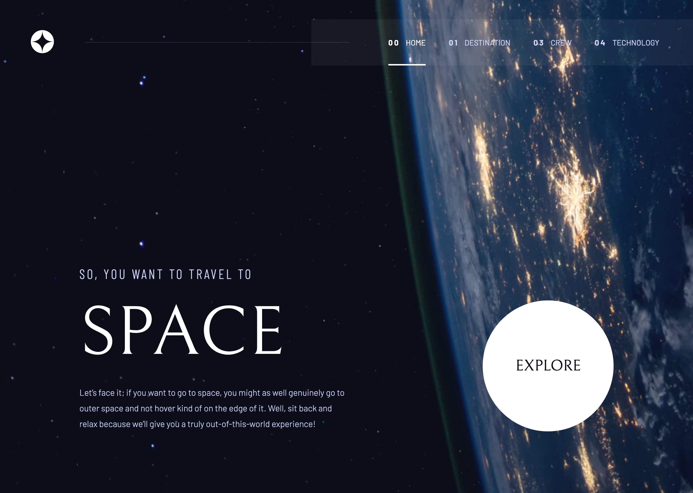

# 🚀 Space Tourism Website

A modern, responsive, and interactive space tourism website built with **React + TypeScript** featuring **mobile-first design**, **smooth animations**, and **interactive navigation**.

---

## 📸 Screenshot



## ✨ Features

- 🌟 Responsive design with mobile-first approach
- 📱 Interactive hamburger menu for mobile devices
- 🎯 Click-outside functionality for improved UX
- 💫 Smooth transitions and animations
- 🖼️ Optimized image handling and responsive layouts
- 🎨 Beautiful blur effects on scroll
- 📐 Properly centered components and layouts
- 🔄 Dynamic viewport handling

---

## 🧱 Project Structure

```
.
├── src/
│   ├── components/         # Reusable React components
│   ├── styles/            # CSS modules and global styles
│   ├── assets/           # Images and static assets
│   └── App.tsx           # Main application component
├── public/               # Public assets and images
└── index.html           # Entry point
```

---

## 🚀 Getting Started

### 1. Clone the repository

```bash
git clone https://github.com/aminetiouk/space-tourism-website
cd space-tourism-website
```

### 2. Install dependencies

```bash
npm install
```

### 3. Run locally

```bash
npm run dev
```

The app should be running at [http://localhost:5173](http://localhost:5173)

---

## 🧪 Technologies Used

- [React](https://reactjs.org/)
- [TypeScript](https://www.typescriptlang.org/)
- [Vite](https://vitejs.dev/)
- CSS Modules
- Modern CSS Features (Flexbox, Grid, etc.)
- Responsive Design Principles

---

## 🧹 Scripts

| Command           | Description              |
| ----------------- | ------------------------ |
| `npm run dev`     | Start development server |
| `npm run build`   | Build for production     |
| `npm run preview` | Preview production build |

---

## 📝 License

This project is licensed under the MIT License.

---

## 🙌 Acknowledgments

Built with ❤️ using modern React patterns and responsive design best practices.
